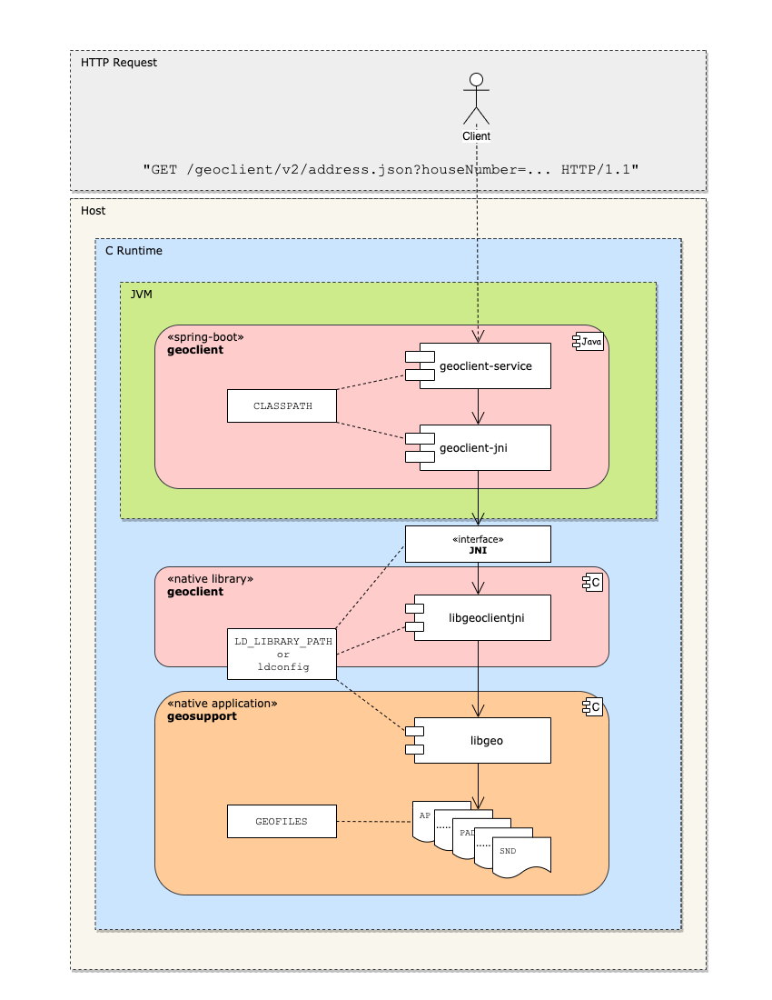

# Geoclient

**Geoclient** is an API for geocoding[^1] locations in New York City. In addition to returning spatial coordinates, Geoclient provides access to a large variety of official NYC attribute data based on the type of location requested.

Geoclient relies on [*Geosupport*](https://www.nyc.gov/site/planning/data-maps/open-data.page#geocoding_application), NYC's official geocoder of record, for primary geocoding services. Geosupport is a separate application written and maintained by the
[Department of City Planning](https://www.nyc.gov/site/planning/index.page).

Benefits of using Geoclient include:

* Platform-independent, stateless REST service for geocoding NYC locations
* Cloud-friendly, microservice architecture with deployment configuration for Kubernetes and other container-based runtimes
* Intuitive, thread-safe Java API for calling Geosupport's native `C` API in-process
* NLP for recognizing and parsing NYC-specific location types
* Better location recognition through configurable search algorthms and error handling
* Awesome low memory, high throughput performance suitable for batch geocoding

## Documentation

See the [website](https://mlipper.github.io/geoclient/):

* [Geoclient User Guide](https://mlipper.github.io/geoclient/docs/current/user-guide/)
* [Javadoc](https://mlipper.github.io/geoclient/docs/current/api/gov/nyc/doitt/gis/geoclient/docs/package-summary.html)

## The big picture

Geoclient is written in `Java` and Geosupport is written in `C`. Geoclient uses the Java Native Interface (`JNI`) to call Geosupport's `C` shared libraries.

## License

[Apache 2.0](https://github.com/CityOfNewYork/geoclient/blob/master/src/dist/license.txt)

[^1]: Wikipedia [article about geocoding](https://en.wikipedia.org/wiki/Address_geocoding#Geocoding_process).